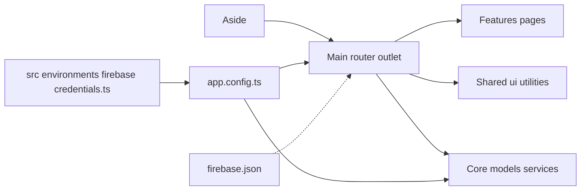

# 🏛️ Architecture Overview — Yelose Portfolio

## 🎯 Objetivo

- **Resumen:** SPA en **Angular 20** con **Angular Material** y **Firebase Hosting**, estructura limpia y escalable, **signals** y control flow **@if/@for**, i18n oficial (EN/ES), SEO y a11y.

---

## 📐 Layout Principal

- **Resumen:** Layout en 2 columnas: **aside fijo** a la izquierda + **main** con `router-outlet` a la derecha.
- Grid CSS: `grid-template-columns: 320px 1fr`.
- Aside: foto, skills, menú, **Language Switcher**.
- Section: páginas cargadas vía router.

---

## 📂 Estructura de Carpetas (Angular 20 + Firebase)

```

/
├─ public/                      # Estáticos servidos tal cual
│  ├─ images/                   # Imágenes y assets públicos
│  ├─ icons/                    # Favicons / PWA icons
│  ├─ robots.txt
│  └─ manifest.webmanifest
├─ src/
│  ├─ app/
│  │  ├─ core/                  # Lógica de dominio (sin config Firebase)
│  │  │  ├─ models/             # Tipos/modelos puros (sin side-effects)
│  │  │  ├─ services/           # Servicios de dominio (SRP, inyectables)
│  │  │  └─ guards-interceptors/ (si aplica)
│  │  ├─ shared/
│  │  │  ├─ ui/                 # Componentes UI reutilizables (standalone)
│  │  │  └─ utilities/          # Pipes/directivas utilitarias
│  │  ├─ features/
│  │  │  ├─ pages/              # Páginas (standalone)
│  │  │  │  ├─ home/
│  │  │  │  ├─ work/
│  │  │  │  ├─ case/
│  │  │  │  ├─ cv/
│  │  │  │  ├─ contact/
│  │  │  │  ├─ notes/ (opt)
│  │  │  │  ├─ oss/   (opt)
│  │  │  │  └─ playground/ (opt)
│  │  │  └─ components/        # Componentes propios de cada feature
│  │  ├─ app.routes.ts
│  │  └─ app.config.ts          # Providers (Router, AngularFire, Material, etc.)
│  ├─ locale/                   # i18n XLF: messages.xlf, messages.es.xlf
│  └─ theme/                    # SCSS de theming (Angular Material)
├─ src/environments/
│  └─ firebase-credentials.ts   # credenciales (gitignored)
├─ firebase.json                # rewrites y hosting
├─ .firebaserc
├─ angular.json                 # localize/sourceLocale + builder
└─ ...

```

- **Resumen:**
  - **`public/`** sustituye a `assets/` (estáticos directos).
  - **Firebase** se configura en `app.config.ts` (providers) + credenciales en `src/environments/firebase-credentials.ts` (**gitignored**).
  - **i18n**: carpeta recomendada `src/locale/` define rutas en `angular.json`.

---

## 🧩 Capas y Responsabilidades

- **Core:** modelos y servicios de dominio (sin detalles de Firebase).
- **Shared:** UI y utilidades reutilizables (standalone).
- **Features:** páginas y componentes específicos de cada sección.
- **Configuración app:** `app.config.ts` con `provideRouter(...)`, `provideFirebaseApp(...)`, `provideFirestore(...)`, etc.
- **Resumen:** separación clara, **SRP** y providers globales en `app.config.ts`.

---

## 🔧 Decisiones Técnicas (Angular 20)

- **Resumen:**
  - **Standalone components** en todas partes.
  - **Signals** para estado local y derivado; interoperar con RxJS solo si aporta valor.
  - **Control flow nuevo**: `@if`, `@for`, `@switch` (evitar `*ngIf`, `*ngFor`).
  - **Angular Material** con theming SCSS en `src/theme/`.
  - **Routing** organizado por features.

---

## 🌍 i18n Oficial (EN/ES)

- **Resumen:** usar `@angular/localize` 20, extracción XLF y builds por idioma.
- **Extract:** `ng extract-i18n --format xlf --output-path src/locale`
- Archivos: `src/locale/messages.xlf` y `src/locale/messages.es.xlf`.
- `angular.json`:
  - `sourceLocale: "en"`
  - `localize: ["en", "es"]`
- **Rutas**: títulos con `$localize`, textos con `i18n` en plantillas.
- **Firebase Hosting**: rewrites para `/en/**` y `/es/**` hacia los HTML generados por build localizado.

---

## ☁️ Firebase (sin lógica en Core)

- **Resumen:** la config Firebase se **inyecta** en `app.config.ts`.
- `src/environments/firebase-credentials.ts`:

  ```ts
  export const firebaseCredentials = {
    /* ... */
  };
  ```

````

* `app.config.ts`:

  ```ts
  export const appConfig: ApplicationConfig = {
    providers: [provideZoneChangeDetection({ eventCoalescing: true }),
    provideRouter(routes),
    provideFirebaseApp(() => initializeApp(firebaseCredentials)),
    provideFirestore(() => getFirestore())]
  };

````

---

## 🧭 Rutas (esquema)

- **Resumen:** páginas principales:

  - `/` Home
  - `/work` Proyectos
  - `/case/:id` Estudio de caso
  - `/cv` CV (web + descarga PDF)
  - `/contact` Contacto
  - `/notes`, `/oss`, `/playground` (opcionales)

- **Idiomas:** prefijos `/en/*` y `/es/*` según builds localizados + rewrites en Firebase.

---

## 🧱 Principios SOLID

- **S — Single Responsibility:** cada componente/servicio hace una cosa.
- **O — Open/Closed:** extensible con nuevas páginas/servicios sin tocar los existentes.
- **L — Liskov:** interfaces claras para modelos/repositorios.
- **I — Interface Segregation:** interfaces pequeñas y específicas.
- **D — Dependency Inversion:** Angular DI + providers; UI desacoplada de datos.

---

## 📊 Diagrama (alto nivel)




---

## ✅ Checklist de esta arquitectura

- **Resumen:**

  - `public/` como estáticos (Angular 20).
  - `app.config.ts` con providers (Router, AngularFire, Material).
  - `src/environments/firebase-credentials.ts` (gitignored).
  - i18n en `src/locale/` + `angular.json` con `localize`.
  - Features/páginas separadas y standalone.
  - Theming en `src/theme/`.
